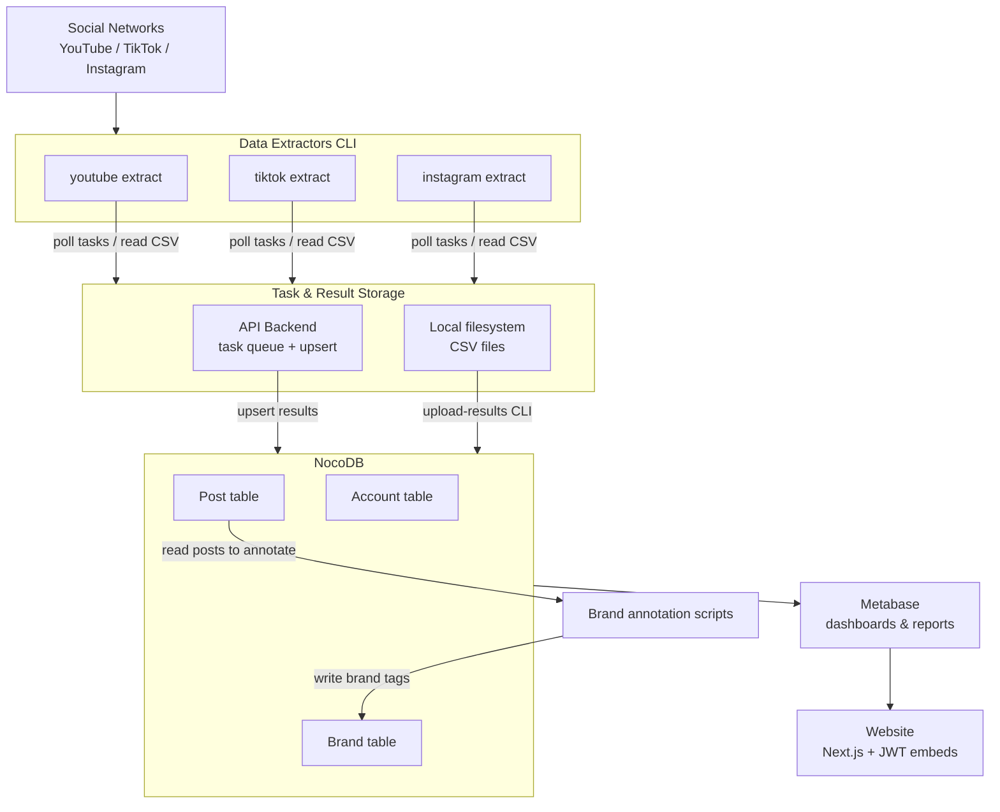

# Technical components overview

The project is composed of the following components:

| Component | Description | Tech Stack |
|---|---|---|
| **Data Extractors** (CLI) | Python CLI that fetches posts from YouTube, TikTok, Instagram | Python, `uv`, YouTube Data API v3, TikTokApi, instaloader |
| **Data Extraction API Backend** (`opi-api`) | Central server for task management, result aggregation, and NocoDB upserts | Python FastAPI, PostgreSQL (asyncpg), NocoDB REST client |
| **Brand annotation scripts** (CLI) | Python scripts that annotate brands for posts | Python, `uv` |
| **NocoDB** | No-code database used as shared storage for extracted accounts and posts and brands | NocoDB , PostgreSQL backend |
| **Metabase** | BI tool for dashboards and reports | Metabase (Coolify-managed) |
| **PostgreSQL** | Relational database used by both the API backend (task queue) and NocoDB | PostgreSQL |
| **Website** (`frontend`) | Public-facing Next.js application embedding Metabase dashboards | Next.js 16 (App Router), TypeScript, Tailwind CSS v4, shadcn/ui |

# Data flow

1. **Task generation**: Account URLs are read from a CSV and extraction tasks are created (either in the API backend or a local CSV file). Task types: `extract-account`, `extract-post-list`, `extract-post-details`.
2. **Extraction**: The Data Extractors CLI polls for available tasks (from the API backend or local CSV), executes them against the corresponding social network API, and stores results.
3. **Result storage**: Results are upserted into NocoDB tables (via the API backend or the `upload-results` CLI sub-command).
4. **Brand annotation**: Scripts tag posts with brand information (linking to a `Brand` table).
5. **Reporting**: Metabase reads from NocoDB to power dashboards.
6. **Website**: The Next.js frontend embeds Metabase dashboards.

# Data Model

## NocoDB (shared extraction results)

Tables are created by [`noco_setup/create-noco-tables.sh`](../noco_setup/create-noco-tables.sh).

### Account table

| Field | Type | Description |
|---|---|---|
| `Social Network` | SingleSelect | `youtube`, `tiktok`, or `instagram` |
| `Account Id` | SingleLineText | Platform account ID (e.g. YouTube `UC...` channel ID) |
| `Enable Data Extraction` | Checkbox | Whether to include this account in extraction |
| `Handle` | SingleLineText | Display handle / custom URL |
| `Description` | LongText | Biography / channel description |
| `Follower Count` | Number | Number of followers / subscribers |
| `Following Count` | Number | Number of accounts this account follows |
| `Post Count` | Number | Number of posts / videos |
| `View Count` | Number | Total view count |
| `Like Count` | Number | Total like count |
| `Categories` | LongText | Channel categories as defined by social network |
| `Account Extraction Date` | Date | When data was extracted |
| `Posts` | Links (has-many) | Relation to Post table |

### Post table

| Field | Type | Description |
|---|---|---|
| `Post Id` | SingleLineText | Platform post ID (e.g. YouTube video ID, Instagram shortcode) |
| `Post Url` | URL | Direct URL to the post |
| `Published At` | DateTime | Post publication date |
| `Title` | SingleLineText | Post title |
| `Description` | LongText | Post description / caption |
| `Comment Count` | Number | Number of comments |
| `Save Count` | Number | Number of saves |
| `View Count` | Number | Number of views |
| `Repost Count` | Number | Number of reposts |
| `Share Count` | Number | Number of shares |
| `Categories` | LongText | Category / topic labels |
| `Tags` | LongText | Hashtags or channel tags |
| `Post Type` | SingleLineText | Type of post (e.g. `video`, `GraphSidecar`) |
| `SN Brand` | SingleLineText | Sponsoring brand as provided by social network |
| `SN Has Paid Placement` | Checkbox | Whether the social network flags this as sponsored |

### Brand table

The Brand table is expected by the labelling workflow but its structure is not yet defined in the NocoDB setup scripts. At minimum it should contain a brand name and slug. A `BrandPost` junction table (or a link field on Post) connects brands to posts.

---

## PostgreSQL (API Backend internal schema)

The API backend manages its own PostgreSQL schema (`v1`) via `golang-migrate` migrations.

### `v1.extraction_task`

Central task queue shared between the API backend and Data Extractors.

| Column | Type | Description |
|---|---|---|
| `uid` | uuid (PK) | Auto-generated identifier |
| `created_at` | timestamptz | Record creation timestamp |
| `type` | text | `extract-account`, `extract-post-list`, or `extract-post-details` |
| `config` | json | Task-specific configuration (account_id, date range, etc.) |
| `social_network` | text | Target platform |
| `status` | text | `AVAILABLE`, `ACQUIRED`, `COMPLETED`, or `FAILED` |
| `visible_at` | timestamptz | When an ACQUIRED task becomes available again (240 min timeout) |
| `error` | text | Error message if FAILED |
